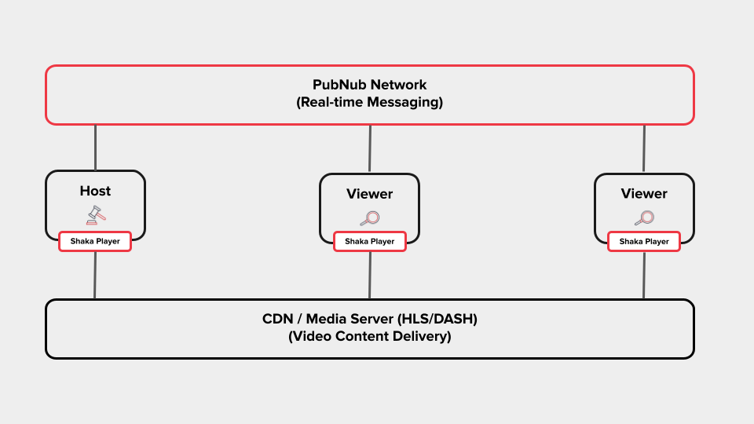

<div align="center">

# @pubnub/shaka-player

### Real-Time Synchronized Video Playback

[](https://www.npmjs.com/package/@pubnub/shaka-player)
[](https://www.pubnub.com/)
[](LICENSE)

</div>

---

**This is not vanilla Shaka Player.** This is a PubNub-enhanced fork that adds real-time playback synchronization—enabling "Watch Party" experiences where multiple viewers stay perfectly in sync.

Looking for the original? See [shaka-player on npm](https://www.npmjs.com/package/shaka-player).

---

## What's Different?

| Feature | Shaka Player | @pubnub/shaka-player |
|---------|--------------|---------------------|
| DASH/HLS Streaming | **Y** | **Y** |
| DRM Support | **Y** | **Y** |
| Offline Playback | **Y** | **Y** |
| **Real-Time Sync (Watch Party)** | - | **Y** |
| **Master/Follower Control** | - | **Y** |
| **Automatic Drift Correction** | - | **Y** |
| **Presence Events** | - | **Y** |

---

## Quick Start

### 1. Install

```bash
npm install @pubnub/shaka-player pubnub
```

### 2. Get PubNub Keys

1. Create an account at [admin.pubnub.com](https://admin.pubnub.com)
2. Create a new app and grab your **Publish Key** and **Subscribe Key**

### 3. Sync Playback

```javascript
import shaka from '@pubnub/shaka-player';

// Initialize player
const video = document.getElementById('video');
const player = new shaka.Player();
await player.attach(video);
await player.load('https://example.com/manifest.mpd');

// Create SyncManager with your PubNub keys
const syncManager = new shaka.sync.SyncManager(player, {
  publishKey: 'pub-c-YOUR-PUBLISH-KEY',
  subscribeKey: 'sub-c-YOUR-SUBSCRIBE-KEY',
  userId: 'user-123',              // Optional: auto-generated if omitted
  maxDriftThreshold: 0.5,          // Seconds before force-sync (default: 0.5)
  syncIntervalMs: 5000             // Sync pulse interval (default: 5000)
});

// Join a watch party room
syncManager.connect('friday-movie-night');

// Control playback for everyone (or stay as follower)
syncManager.becomeMaster();
```

---

## SyncManager API

| Method | Description |
|--------|-------------|
| `connect(roomId)` | Join a sync room |
| `disconnect()` | Leave the current room |
| `becomeMaster()` | Take control of playback for all viewers |
| `becomeFollower()` | Follow the master's playback |
| `getRole()` | Returns `'master'` or `'follower'` |
| `isConnected()` | Returns connection status |
| `getRoomId()` | Returns current room ID |
| `getUserId()` | Returns this client's user ID |
| `destroy()` | Clean up resources |

### Events

```javascript
syncManager.addEventListener('masterchanged', (event) => {
  console.log('New master:', event.newMasterId);
});
```

---

## How Sync Works



1. **Master** controls playback (play, pause, seek)
2. Commands are sent instantly via PubNub to all connected clients
3. **Followers** receive and apply commands with latency compensation
4. Periodic sync pulses correct any drift between clients

---

## Included Builds

| Build | File | Use Case |
|-------|------|----------|
| Full + UI | `shaka-player.ui.js` | Complete player with UI controls |
| Full | `shaka-player.compiled.js` | Player without UI |
| DASH Only | `shaka-player.dash.js` | Lightweight DASH-only build |
| HLS Only | `shaka-player.hls.js` | Lightweight HLS-only build |

All builds include the SyncManager for Watch Party functionality.

---

## Platform and Browser Support

|Browser       |Windows   |Mac      |Linux    |Android  |iOS >= 9  |iOS >= 17.1|iPadOS >= 13|ChromeOS|Other|
|:------------:|:--------:|:-------:|:-------:|:-------:|:--------:|:---------:|:----------:|:------:|:---:|
|Chrome        |**Y**     |**Y**    |**Y**    |**Y**    |**Native**|**Native** |**Native**  |**Y**   | -   |
|Firefox       |**Y**     |**Y**    |**Y**    |untested⁵|**Native**|**Native** |**Native**  | -      | -   |
|Edge          |**Y**     | -       | -       | -       | -        | -         | -          | -      | -   |
|Edge Chromium |**Y**     |**Y**    |**Y**    |untested⁵|**Native**|**Native** |**Native**  | -      | -   |
|IE            | N        | -       | -       | -       | -        | -         | -          | -      | -   |
|Safari        | -        |**Y**    | -       | -       |**Native**|**Y**      |**Y**       | -      | -   |
|Opera         |**Y**     |**Y**    |**Y**    |untested⁵|**Native**| -         | -          | -      | -   |
|Chromecast²   | -        | -       | -       | -       | -        | -         | -          | -      |**Y**|
|Tizen TV³     | -        | -       | -       | -       | -        | -         | -          | -      |**Y**|
|WebOS⁶        | -        | -       | -       | -       | -        | -         | -          | -      |**Y**|
|Hisense⁷      | -        | -       | -       | -       | -        | -         | -          | -      |**Y**|
|Vizio⁷        | -        | -       | -       | -       | -        | -         | -          | -      |**Y**|
|Xbox One      | -        | -       | -       | -       | -        | -         | -          | -      |**Y**|
|Playstation 4⁷| -        | -       | -       | -       | -        | -         | -          | -      |**Y**|
|Playstation 5⁷| -        | -       | -       | -       | -        | -         | -          | -      |**Y**|

**Notes:**
- ²: The latest stable Chromecast firmware is tested. Both sender and receiver can be implemented.
- ³: Tizen 2017 model is actively tested. Tizen 2016 is community-supported.
- ⁵: Expected to work but not actively tested.
- ⁶: Community-supported. See [official WebOS support issue](https://github.com/shaka-project/shaka-player/issues/1330).
- ⁷: Community-supported and untested by us.

**iOS/iPadOS Notes:**
- iOS 9+ supported through Apple's native HLS player
- iPadOS 13+ supports MediaSource Extensions
- iPadOS 17 and iOS 17.1+ support ManagedMediaSource Extensions

---

## DRM Support

|Browser       |Widevine  |PlayReady|FairPlay |ClearKey |
|:------------:|:--------:|:-------:|:-------:|:-------:|
|Chrome¹       |**Y**     | -       | -       |**Y**    |
|Firefox²      |**Y**     | -       | -       |**Y**    |
|Edge³         | -        |**Y**    | -       | -       |
|Edge Chromium |**Y**     |**Y**    | -       |**Y**    |
|Safari        | -        | -       |**Y**    | -       |
|Opera         |**Y**     | -       | -       |**Y**    |
|Chromecast    |**Y**     |**Y**    | -       |**Y**    |
|Tizen TV      |**Y**     |**Y**    | -       |**Y**    |

**Notes:**
- ¹: Only official Chrome builds contain Widevine CDM
- ²: DRM must be enabled by the user on first visit
- ³: PlayReady in Edge may not work on VMs or Remote Desktop

---

## Streaming Format Support

|Format|Video On-Demand|Live |Event|In-Progress Recording|
|:----:|:-------------:|:---:|:---:|:-------------------:|
|DASH  |**Y**          |**Y**| -   |**Y**                |
|HLS   |**Y**          |**Y**|**Y**| -                   |

Custom manifest formats can be supported via [manifest parser plugins](https://shaka-project.github.io/shaka-player/docs/api/tutorial-manifest-parser.html).

---

## Additional Features

This package includes all features from Shaka Player:

- Offline storage and playback via IndexedDB
- Subtitles: WebVTT, TTML, CEA-608/708, SubRip (SRT)
- Thumbnails: DASH-IF, HLS Image Playlists, I-frame playlists, external WebVTT
- VR/360° video support
- Monetization: IMA SDK, IMA DAI, AWS MediaTailor, HLS interstitials
- Content Steering (v1)
- MPEG-5 Part2 LCEVC decoding support

---

## Documentation

| Resource | Link |
|----------|------|
| Watch Party Demo | [demo/sync/](demo/sync/) |
| Full API Docs | [shaka-project.github.io/shaka-player/docs/api](https://shaka-project.github.io/shaka-player/docs/api/index.html) |
| Tutorials | [Shaka Tutorials](https://shaka-project.github.io/shaka-player/docs/api/tutorial-welcome.html) |
| PubNub Dashboard | [admin.pubnub.com](https://admin.pubnub.com) |
| PubNub Docs | [pubnub.com/docs](https://www.pubnub.com/docs) |

---

## Contributing

We welcome contributions. Please read [CONTRIBUTING.md](CONTRIBUTING.md) for guidelines.

---

## License

Apache 2.0 - See [LICENSE](LICENSE)

---

<div align="center">

**Powered by [PubNub](https://www.pubnub.com)**

<a href="https://www.pubnub.com">
  
</a>

<br><br>

*Based on [Shaka Player](https://github.com/shaka-project/shaka-player) by Google*

</div>
